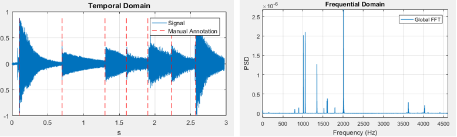
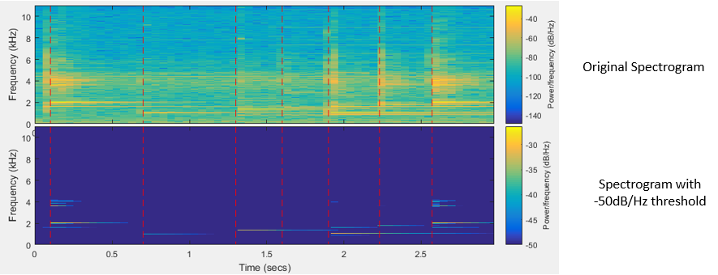
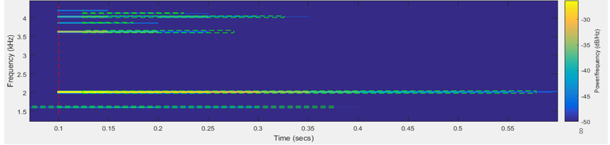
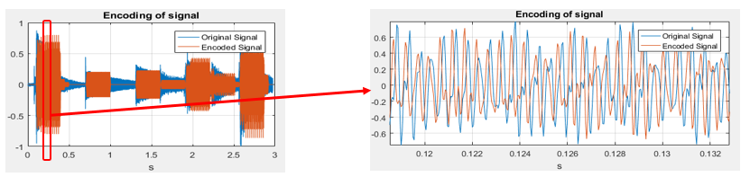

# Shazam-like

A Matlab App that extracts the partition of a music by studying its temporal-frequential representation (spectrogram). This is certainly the processing done by Shazam in order to recognize a music.
This app enables to:
- Study Temporal/Frequential and Spectrogram representation of a signal
- Extract the partition of the music
- Regenerate the music using this partition

## ⌛ Global Analysis of music

- Temporal + Frequential Analysis enable to determine the best compromise of accuracy. 
   ↗ Frequency Accuracy ⇒ ↘ Temporal Accuracy. Need both to analysis a music.
- Compromise chosen → 21Hz of frequency resolution and 0.046s of temporal resolution
- 20Hz is enough in order to regroup close notes into the same frequency

## 👩‍💻 Spectral Analysis of music

- Using an appropriate threshold enables to exctract main notes while removing a maximum of noise

## 🎼 Extraction of partition

- The chosen algorithm for the extraction of the partition is a flood-fill algorithm (homemade)
- This enables to avoid doublons of occurences of notes

## 🎸 Regeneration of the music

- Based on the partition and the power of each note, it is possible to regerate the music.
- You can hear the difference in the example in the App:
        between  `lac_des_cygnes_original.wav` and `lac_des_cygnes_encoded.wav`

## Authors
David Szmul - [Github](https://github.com/DavidSzmul) | [LinkedIn](https://www.linkedin.com/in/david-szmul-207564134/)   
